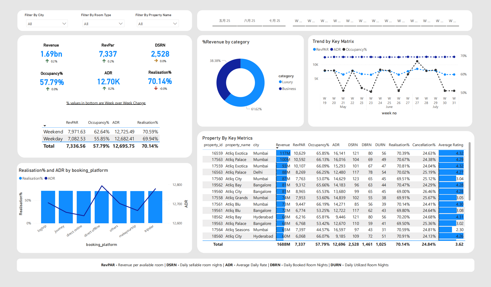

# Hotel Performance Dashboard

## 📊 Project Overview
Power BI dashboard analyzing **3 months of hotel booking performance** across multiple properties, tracking key hospitality metrics including:
- Revenue
- RevPAR (Revenue Per Available Room)
- DSRN (Daily Sellable Room Nights)
- Occupancy %
- ADR (Average Daily Rate)
- Realization %

## 🛠️ Setup Instructions

### Prerequisites
- Power BI Desktop 

### Installation
1. Clone this repository
2. Open `PowerBI_Hotel_Revenue.pbix`
3. Update data source path to your local copy:
   - `Transform Data` → `Data Source Settings`
4. Refresh data (`Home` → `Refresh`)

## 📈 Key Metrics Calculated

| Metric | Formula | Description |
|--------|---------|-------------|
| **RevPAR** | `DIVIDE([Revenue],[Total Bookings],0) ` | Revenue per available room |
| **DSRN** | `DIVIDE([Total Capacity],[No of days]) ` | Daily sellable inventory |
| **Occupancy %** | `DIVIDE([Total Successful Booking],[Total Capacity],0)` | Utilization rate |
| **ADR** | `DIVIDE([Revenue],[Total Bookings],0) ` | Average daily rate |
| **Realization %** | `1-([Cancellation%]+[No Show Rate%]) ` | Price optimization efficiency |

## 📅 Data Coverage
- **Period**: May - July 2025
- **Properties**: 7 hotels across 4 cities
- **Update Frequency**: Weekly manual uploads

## 🔍 Sample Analysis Views
1. **Key matrix cards**
   - Revenue
   - Occupancy%
   - RevPar
   - ADR
   - DSRN
   - Realisation%

2. **Table of property by key metrics**
   - All 6 key metrix
   - DBRN, DURN, Cancellation%, Average Rating

3. **Trend by key matrix**
   - Week over week performance patterns
   

## 📝 Documentation
- (docs/meta_data_hospitality.md) - Data Dictionary Field definitions and sources
- (docs/metrics list.md) - Metric Formulas Detailed KPI calculations
- (docs/power_query_doc.md) - Data Loading and Power Query Documentation

